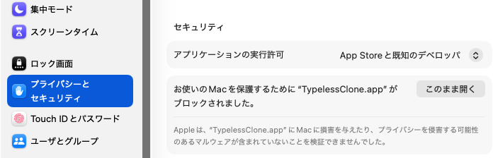

# TypelessClone

macOS メニューバー常駐の音声入力アプリです。
`fn` を押している間だけ録音し、離したら文字起こししてアクティブアプリに貼り付けます。


## インストール（DMG から）

開発環境は不要です。macOS 14 以上で動作します。

### 1. ダウンロード

[GitHub Releases](../../releases/latest) から最新の `TypelessClone-*.dmg` をダウンロードしてください。

### 2. アプリを Applications にコピー

DMG を開いて `TypelessClone.app` を `Applications` フォルダにドラッグ＆ドロップします。

### 3. 初回起動（Gatekeeper の許可）

このアプリはアドホック署名のため、初回起動時に macOS の Gatekeeper にブロックされます。

1. `/Applications/TypelessClone.app` をダブルクリック → ブロックされるので **「完了」** を押す
2. **システム設定 > プライバシーとセキュリティ** を開く
3. 画面下部に表示される **「このまま開く」** をクリック



4. 確認ダイアログで **「開く」** をクリック（以降はダブルクリックで起動可能）

### 4. 権限を許可

初回起動時にダイアログが表示されるので、以下をすべて許可してください。

- マイク
- 音声認識
- アクセシビリティ（システム設定 > プライバシーとセキュリティ > アクセシビリティ）
- 入力監視（システム設定 > プライバシーとセキュリティ > 入力監視）

### 5. API キーを設定

メニューバーのアイコン →「設定」から **Gemini API キー** を入力してください。
[Google AI Studio](https://aistudio.google.com/apikey) で無料で取得できます。

> API キーを設定しなくても Apple の音声認識で文字起こしできますが、
> Gemini による校正（リライト）を使う場合はキーが必要です。

### 使い方

- `fn` を押しながら話す
- `fn` を離すと確定して貼り付け
- メニューバーのアイコンから手動録音も可能

## スクリーンショット

### メニューバーUI

待機中のメニュー表示です。`fn` 押下で録音開始、メニューから手動録音もできます。


### 設定画面（Gemini校正）

API キー、認識言語、校正プロンプトを設定できます。


### 設定画面（権限と操作）

録音キーの案内、権限ガイド、システム設定への導線です。


## トラブルシュート

- `アクセシビリティを許可してください` が消えない
  - 許可対象が `/Applications/TypelessClone.app` か確認
  - アプリ再起動を実施

- `fn` で起動しない
  - `入力監視` が ON か確認
  - システム設定 > キーボード > `🌐キーを押して` を `何もしない` に変更

- 設定をやり直したい

```bash
tccutil reset Accessibility com.typelessclone.app
tccutil reset ListenEvent com.typelessclone.app
tccutil reset PostEvent com.typelessclone.app
```

---

## 開発者向け

### 前提環境

- macOS 14 以上
- Xcode Command Line Tools
- Swift 5.9+（`swift build` が動くこと）

### ソースからビルド

```bash
git clone https://github.com/hanafusay/typeless-clone.git
cd typeless-clone
cp .env.example .env
# .env に GEMINI_API_KEY=... を設定
./build.sh
open /Applications/TypelessClone.app
```

`build.sh` は release ビルド → .app バンドル作成 → コード署名 → `/Applications` にインストールまで一括で行います。

Gatekeeper にブロックされた場合は、**システム設定 > プライバシーとセキュリティ** →「このまま開く」をクリックしてください。

初回起動後、以下の権限を許可してください。
- アクセシビリティ
- 入力監視
- マイク
- 音声認識

権限付与後にアプリを再起動:

```bash
pkill -x TypelessClone; open /Applications/TypelessClone.app
```

### DMG の作成

開発環境がない人向けに、ビルド済みの DMG を作成して配布できます。

```bash
./create-dmg.sh
# dist/TypelessClone-1.0.dmg が生成される
```

この DMG をメール・チャット・ファイル共有などで配布してください。

### リリースの作り方

タグを push すると GitHub Actions が自動で DMG を作成し、GitHub Releases に公開します。

ワークフロー定義は [`.github/workflows/release.yml`](.github/workflows/release.yml) にあります。

```bash
# Info.plist のバージョンを更新してからコミット
git tag v1.0.0
git push origin v1.0.0
```

手動で DMG を作る場合は `./create-dmg.sh` を実行してください。
